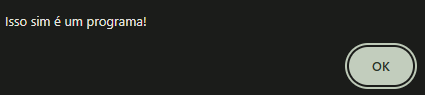
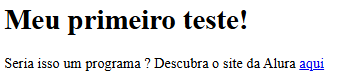
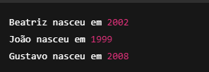

# 🧠 Curso de Lógica de Programação 01 - Alura
 Este repositório contém os projetos e exercícios desenvolvidos durante o curso **Lógica de Programação** da plataforma **Alura**, ministrado pelo professor **Flávio Henrique de Souza Almeida**.

O curso é dividido em **9 módulos**, abordando os principais conceitos introdutórios de lógica de programação de forma prática e progressiva.

## Tecnologias utilizadas

- **HTML**
- **JavaScript**

## Objetivo

Desenvolver a base lógica essencial para iniciantes em programação, com foco na resolução de problemas, estruturas de controle, variáveis, funções e interatividade básica com o usuário.

---

> Projeto desenvolvido para fins educacionais como parte do processo de aprendizado em programação.

## 📘 Módulo 01 – Primeiros Passos com Lógica de Programação
Neste módulo, iniciamos os estudos em lógica de programação com foco na construção de algoritmos simples e introdução ao uso do JavaScript no navegador.

📄 Saída esperada no navegador:

 

    
    
 

🧠 Conceitos abordados:

- O que é um programa

- Estrutura básica de um documento HTML

- Inserção de links e textos em HTML

- Utilização do alert() no JavaScript

- Introdução à interação com o usuário

🚀 Resultado:
Ao abrir o arquivo no navegador, o usuário vê uma página com um título, um parágrafo com link, e um alerta é exibido automaticamente dizendo: "Isso sim é um programa!"

---

## 📘 Módulo 02 – Escrevendo no Documento com JavaScript
Neste módulo, aprendemos a usar o método document.write() para escrever diretamente na página HTML usando JavaScript, além de realizar cálculos simples dentro das instruções.

📄 Saída esperada no navegador:

 

  
 

 🧠 Conceitos abordados:

- Inserção de conteúdo dinâmico com document.write()

- Concatenando texto com variáveis e expressões

- Operações matemáticas básicas em tempo real

- Uso do JavaScript para calcular o ano de nascimento

---
